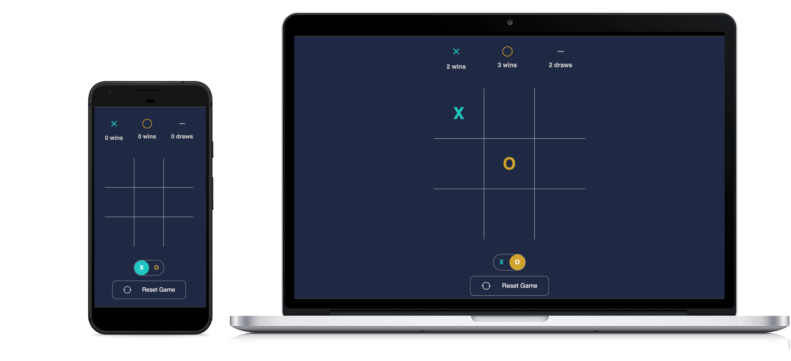

<h1 align="center">
  S3T-Simple Tic Tac Toe
</h1>

<h1 align="center">
  
</h1>

  

  

  

  

## :question: About

Simple Tic-tac-toe game built with React.js, this project was made to apply my studies in:
- React.js
- Git and Github
- tests
- responsive layout and styled-components.

## :running: Running

- clone or download this repo
- open project with terminal/cmd and type: `yarn` or `npm install` to install dependencies
- run: `yarn start` or `npm start` to run project in `localhost:3000` if this port is available

## :books: Techs and Libs

- react-app-rewired (customize cra)
- styled-components
- react-icons
- eslint, prettier and editorConfig (code linting and styling)
- Tests
  - jest
  - @types/jest
  - jest-localstorage-mock
  - @testing-library/react
  - @testing-library/jest-dom
  - @testing-library/user-event
